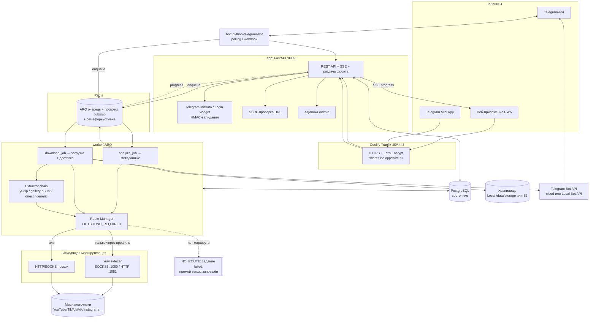
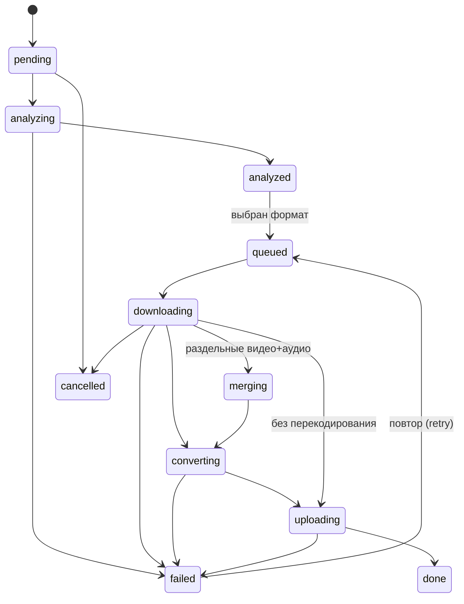

# Архитектура ShareTube

ShareTube — сервис загрузки медиа по ссылке: Telegram-бот, веб-приложение, Telegram Mini App,
backend API (FastAPI), очередь фоновых задач (ARQ/Redis), downloader-workers, обязательная
маршрутизация через Xray/proxy, хранилище (local/S3) и админка.

## Стек

- **Backend:** Python 3.12, FastAPI, Pydantic v2, SQLAlchemy 2 (async), Alembic, PostgreSQL, Redis,
  ARQ, python-telegram-bot (async), yt-dlp, gallery-dl, FFmpeg/FFprobe.
- **Frontend:** React + TypeScript + Vite, PWA, Telegram Mini Apps API, SSE-прогресс.
- **Инфраструктура:** Docker Compose, Coolify + Traefik (домен/HTTPS), Xray sidecar, JSON-логи.

Один Docker-образ `sharetube-app` запускается в трёх ролях по первому аргументу
(`apps/backend/entrypoint.sh`): `api`, `worker`, `bot`. Наружу публикуется только `app` (порт 8989);
postgres, redis, xray, local bot api в интернет не выставляются.

---

## Диаграмма компонентов и потока данных



Ключевые правила потока:

- Пользователь шлёт ссылку из бота / веба / Mini App → API валидирует (SSRF) и создаёт задание →
  кладёт в очередь Redis.
- `analyze_job` получает метаданные **без полной загрузки** через выбранный outbound-профиль;
  пользователь выбирает формат.
- `download_job` качает через **обязательный** маршрут (Xray/proxy), сохраняет в хранилище и
  доставляет в Telegram по фактическому размеру.
- Прогресс идёт в Redis pub/sub → API отдаёт его по **SSE** вебу и правит progress-сообщение в боте.
- Если исправного маршрута нет — **`NO_ROUTE`**, прямого выхода в интернет нет.

---

## Машина состояний задания

`JobStatus` (`apps/backend/app/models.py`):



Последовательность:
`pending → analyzing → analyzed → queued → downloading → merging → converting → uploading → done`,
с ветками `failed` и `cancelled`. `merging`/`converting` включаются только при необходимости
(раздельные дорожки, несовместимый кодек). Зависшие задания фейлит `recover_stale_cron` (`timeout`),
после чего доступен повтор.

Дополнительно: `ContentType` (`video`, `short`, `audio`, `photo`, `photo_carousel`, `mixed`,
`playlist`, `live`, `unknown`) и `DeliveryMethod` (`cloud_bot`, `local_bot`, `signed_link`,
`zip_link`, `cached_file_id`).

---

## Таблицы БД

Схема — `apps/backend/app/models.py`, миграции — `apps/backend/migrations/`.

| Таблица | Назначение |
|---|---|
| `users` | Пользователи, флаги `is_admin`/`is_blocked`, дневные квоты. |
| `telegram_accounts` | Привязка Telegram-аккаунтов к `users` (telegram_id, username). |
| `download_jobs` | Задания: url, источник, статус, прогресс, размер, доставка, ошибки, heartbeat. |
| `media_sources` | Метаданные источника задания (title, author, длительность, превью, item_count). |
| `media_items` | Элементы карусели/подборки (позиция, тип, размеры) — сохраняют порядок. |
| `selected_formats` | Доступные/выбранные форматы (label, селектор yt-dlp, кодеки, размер). |
| `stored_files` | Сохранённые файлы: provider (local/s3), opaque-токен, путь, размер, `expires_at`. |
| `delivery_attempts` | История попыток доставки (метод, успех, детали). |
| `telegram_file_cache` | Кэш `file_id` по сигнатуре контента — повторная отправка без перезагрузки. |
| `download_links` | Подписанные ссылки: токен, TTL, лимит скачиваний, счётчик, revoke. |
| `cookie_profiles` | Cookie-профили (зашифрованы Fernet), привязка к источнику, health. |
| `proxy_profiles` | Outbound-профили (HTTP/SOCKS/Xray), зашифрованный конфиг, маскированные метаданные, статус. |
| `audit_logs` | Аудит действий админа (actor, action, target, detail, ip). |
| `system_settings` | Пары ключ-значение для рантайм-настроек. |

---

## Интерфейс экстракторов

`MediaExtractor` (`apps/backend/app/extractors/base.py`) — бизнес-логика не привязана к конкретной
библиотеке. Методы: `can_handle`, `fetch_metadata` (метаданные без полной загрузки), `download`.

Реализации:

- `YtDlpExtractor` — yt-dlp (видео/аудио: YouTube, TikTok, Vimeo, Twitch, Twitter, Reels-видео);
- `GalleryDlExtractor` — gallery-dl (фото/карусели: Instagram, VK-альбомы и т.п.);
- `VkExtractor` — специализированный для VK;
- `DirectFileExtractor` — прямые файлы по URL;
- `GenericExtractor` — универсальный fallback.

**Цепочка fallback** (`apps/backend/app/extractors/selector.py`, `get_extractor_chain`):

| Источник | Порядок экстракторов |
|---|---|
| `direct` | DirectFile → Generic |
| `vk` | VK → gallery-dl → Generic |
| `instagram` | gallery-dl → yt-dlp → Generic |
| `youtube/tiktok/vimeo/twitch/twitter` | yt-dlp → Generic |
| прочее | yt-dlp → gallery-dl → Generic |

`analyze_url` идёт по цепочке, пока кто-то не вернёт метаданные. Ошибки `auth_required` / `removed` /
`too_large` — окончательные (цепочку не продолжают).

---

## Провайдеры хранилища

`apps/backend/app/storage/` — единый интерфейс `base.py` + фабрика `factory.py`
(`STORAGE_PROVIDER=local|s3`):

- **LocalStorageProvider** (`local.py`) — файлы в `STORAGE_DIR=/data/storage`, отдача через
  подписанные ссылки со стримингом и HTTP Range; лимит `MAX_STORAGE_GB` с вытеснением старых файлов.
- **S3StorageProvider** (`s3.py`) — объектное хранилище; скачивание — редирект на **presigned URL**.

Скачивание файла — `GET /download/{token}` (`apps/backend/app/routers/download.py`): проверка
подписи/TTL/лимита, защита от перебора токенов, Range-запросы.

---

## Решение о доставке (по фактическому размеру)

`apps/backend/app/services/delivery.py` — выбор по **реальному** размеру файла, лимиты из конфигурации:

1. `size ≤ CLOUD_BOT_SAFE_LIMIT_MB` (45 МБ) → **cloud_bot** (обычный Bot API);
2. иначе, если включён Local Bot API и `size ≤ LOCAL_BOT_SAFE_LIMIT_MB` (1900 МБ) → **local_bot**;
3. иначе → **signed_link** (временная ссылка, TTL `DOWNLOAD_LINK_TTL_HOURS`) + предложение снизить
   качество / только аудио;
4. фото/карусели → альбомы `sendMediaGroup` (по 10) или **zip_link** для крупных подборок;
5. повторная отправка того же контента — по кэшированному `file_id` (**cached_file_id**).

Видео отправляется потоковым (`streamable`) только при MP4/H.264/AAC; иначе — документом.

---

## Outbound-профили и маршрутизация

`apps/backend/app/outbound/` — `OutboundProfile` (`base.py`), `HttpProxyProfile`, `XrayProfile`,
менеджер `manager.py`. Политика `OUTBOUND_REQUIRED=true`: загрузки идут **только** через профиль;
при отсутствии маршрута — `NoRouteError` → задание `failed` (`no_route`). Подробнее —
[docs/proxy.md](proxy.md).

---

## Каталог кода (ориентир)

```
apps/backend/app/
  main.py            сборка FastAPI, роутеры, статика фронта
  config.py          настройки из .env (pydantic Settings)
  models.py          ORM-схема (все таблицы выше)
  worker.py          ARQ: analyze_job, download_job, cron-обслуживание
  tgbot.py           Telegram-бот (python-telegram-bot)
  queue.py           ARQ/Redis: enqueue, прогресс pub/sub, отмена
  routers/           admin, auth, download, jobs, health
  extractors/        base, ytdlp, gallerydl, vk, directfile, generic, selector, sources
  outbound/          base, http_proxy, xray, manager (маршрутизация)
  storage/           base, factory, local, s3
  services/          delivery, jobs, storage_service, telegram_delivery, serialize
  security/          ssrf, filenames, ratelimit, signed_urls, telegram_auth, crypto
services/xray/       Xray sidecar (генерация конфига из URI/JSON)
```
